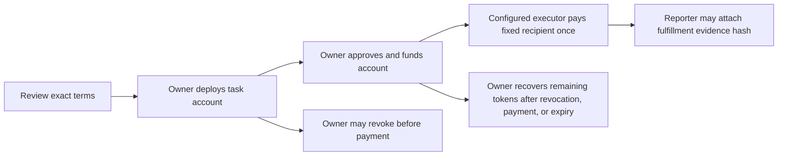

<div align="center">

# 🌊 Floww Task Smart Account

### One task. One bounded payment. Clear on-chain rules.

A Sepolia-only task wallet for a single ERC-20 payment, with immutable execution terms and a separately recorded fulfillment reference.

[](#sepolia-demo-deployment)
[](#trust-and-evidence-boundaries)
[](#build-and-test)

<br />

[Integration Hub](https://github.com/web5five/Floww) · [Server Repository](https://github.com/web5five/Floww_Server) · [Client Repository](https://github.com/web5five/Floww_Client)

</div>

---

## ✨ What is this?

Floww Task Smart Account is a task-scoped contract wallet for **one bounded ERC-20 payment** on Ethereum Sepolia.

The owner deploys the account directly, fixing the token, recipient, executor, fulfillment reporter, maximum spend, and expiry in immutable contract state. The contract derives a mandate hash from the Sepolia chain ID, owner, task ID, review snapshot digest, and every immutable execution term.

The configured executor can pay the fixed recipient once. The owner can revoke spending authority before payment and recover remaining tokens after revocation, payment, or expiry.

> The owner’s deployment of the account is the on-chain approval boundary in this slice. The user must review the exact terms in a trusted UI before signing the deployment.

---

## 🔒 Trust & Evidence Boundaries

- The contract rejects chains other than Ethereum Sepolia (`11155111`).
- Token amounts use integer base units. The included test token uses 6 decimals.
- `MockUSDC` is a faucet-enabled test fixture deployed by the demo script. It has no real value and must never be presented as Circle USDC. Verify any separately configured test token address from a trusted source.
- Sepolia ETH pays deployment, approval, funding, and execution gas. This demo does not sponsor gas.
- The recipient and executor cannot be changed after deployment.
- A payment event proves that the ERC-20 transfer succeeded on-chain. It does not prove that an order was accepted or delivered.
- Only the immutable fulfillment reporter can attach a nonzero evidence hash to the matching payment. The hash is an audit reference, not cryptographic proof of delivery; the reporter and evidence-verification process remain trust assumptions.
- The account permits one payment only. Payment or owner revocation ends spending authority. Expiry blocks execution even before a cleanup transaction.
- The account does not hold or expose the user’s main private key. The owner funds each task account separately.
- This is **not** an ERC-4337 account, a general-purpose wallet, a production USDC deployment, or proof that the Floww server and client are integrated.

---

## 🧭 Payment Lifecycle



---

## 🧪 Build & Test

Install [Foundry](https://book.getfoundry.sh/) and install the pinned Solidity dependencies:

```bash
forge install OpenZeppelin/openzeppelin-contracts@v5.4.0
forge install foundry-rs/forge-std@v1.9.7
```

Run the test suite and formatter check:

```bash
forge test -vvv
forge fmt --check
```

Tests run locally on Anvil’s EVM with the chain ID set to Sepolia. They cover authorization, one-time payment, amount limits, expiry, revocation, refunds, and separate fulfillment reporting.

**These tests are not a Sepolia deployment or live transaction proof.**

---

## 🚀 Sepolia Demo Deployment

Use a fresh, test-only deployer key. Fund the deployer and executor with faucet Sepolia ETH. Keep `.env` and all private keys out of Git; `.env.example` contains placeholders only.

```bash
cp .env.example .env
```

Replace every placeholder in `.env`, including a future expiry timestamp, then load the values into your shell:

```bash
set -a
source .env
set +a
```

Run the deployment script:

```bash
forge script script/DeploySepoliaDemo.s.sol:DeploySepoliaDemo \
  --rpc-url "$SEPOLIA_RPC_URL" \
  --broadcast
```

The script deploys a new faucet-enabled `MockUSDC`, mints the configured test amount to the deployer, and deploys the task account from that same owner address.

`FLOWW_REVIEW_SNAPSHOT_DIGEST` must identify the exact server-side reviewed snapshot. The account derives its on-chain mandate hash from that reference and the deployed terms.

Record the token and account addresses, along with the deployment transaction, from Foundry’s output.

### Demo interaction sequence

1. The owner separately approves the account and calls `fund`.
2. The executor calls `executePayment(paymentId, amount)`.
3. Only after the simulated merchant fulfills the order, the configured reporter may call `confirmFulfillment(paymentId, evidenceHash)`.
4. Read `paymentExecuted`, `fulfillmentConfirmed`, and `paymentId` independently from the chain, and inspect the emitted events before reporting a result.

---

## 📜 Recorded Sepolia Deployment

The demo deployment from **2026-09-29** has independently checked transaction receipts and read-only contract state in the [deployment evidence record](https://github.com/web5five/Floww_SmartContract/blob/main/evidence/sepolia-2026-09-29.json).

It deployed only the faucet-enabled `fUSDC` fixture and a task account. **No payment or fulfillment was executed.**

The repository does not deploy contracts automatically. The separately executed demo deployment is recorded in the evidence file above.

---

## 🔌 Integration Status

The following still require integration:

- Backend F010/F012 routes
- Production authentication
- Mandate-hash generation
- Wallet UI
- Executor key management
- Merchant fixture
- End-to-end evidence linkage

Do not use this contract with real funds.

---

## 🔗 Project Links

| Resource | Link |
|---|---|
| 🌐 Integration hub | [web5five/Floww](https://github.com/web5five/Floww) |
| ⚙️ Server | [web5five/Floww_Server](https://github.com/web5five/Floww_Server) |
| 🖥️ Client | [web5five/Floww_Client](https://github.com/web5five/Floww_Client) |
| 📄 Sepolia deployment evidence | [2026-09-29 evidence record](https://github.com/web5five/Floww_SmartContract/blob/main/evidence/sepolia-2026-09-29.json) |

---

<div align="center">

### Bounded by design. Verifiable on-chain. 🌊

</div>
